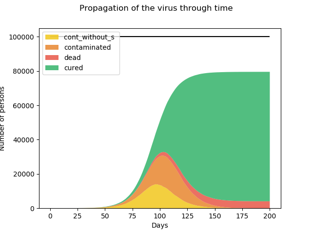

# Simulation propagation of a virus :

## How to use : 

### Required packages :

- Simpy
- Matplotib.pyplot
- Numpy

Python version : 3.7

### Configure simulation elements :

Use configuration.yml file to set up the simulation variables.

### Run simulation :

Execute the following command to launch the simulation

```cmd
python main.py 
```
All logs are printed in the logs.txt file.

Results are printed in the results.png file



## About the simulation :

This simulation uses Simpy to create an discrete-event simulation. 
In this simulation each infected goes through different states: 
Contaminated without symptoms, Contaminated with symptoms, Cured and Dead.
Each event has a probability to occur, these probabilities are determined
in the configuration file.\
During the simulation the patient zero is determined randomly. Meeting zones are created
where persons meet and can infect each other, the number of neighbours is also determined randomly.
To progress in infection stages we use counters that increments each day.
If a person shows symptoms the probability of meeting gets a malus. 
At the end of the simulation stats are printed.
     

Feel free to change the config file to observe how it evolves :).
### Improvements :

- Add vaccines system.
- Simulate different scenarios : Containment - Uncontainment..

   


