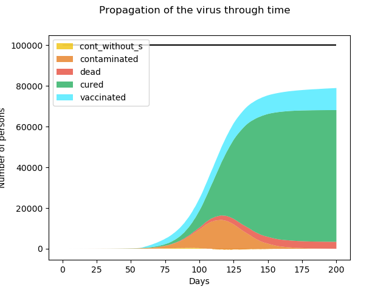

# Simulation propagation of a virus :

## How to use : 

### Required packages :

- Simpy
- Matplotib.pyplot
- Numpy

Python version : 3.7

### Configure simulation elements :

Use configuration.yml file to set up the simulation variables.

### Run simulation :

Execute the following command to launch the simulation

```cmd
python main.py 
```
All logs are printed in the logs.txt file.

3 graphics are generated: Propagation of the virus through time ; Number of new infected person per day ; Rate of current infected and dead person



## About the simulation :

We choose to develop this epidemic broadcast with python and more precisely the library simpy. Simpy is a discrete-event simulation library based on process. With Simpy simulations can be performed in real time or by stepping through the events (obviously our choice). 

The purpose of this simulation is to model the spread of a virus in a population.

In this simulation each infected goes through different states: 
Contaminated without symptoms, Contaminated with symptoms, Cured and Dead.
Each event has a probability to occur, these probabilities are determined
in the configuration file.\
During the simulation the patient zero is determined randomly. Meeting zones are created
where persons meet and can infect each other, the number of neighbours is also determined randomly.
To progress in infection stages we use counters that increments each day.
If a person shows symptoms the probability of meeting gets a malus. 
At the end of the simulation stats are printed.

The simulation also includes a vaccine system. The vaccination appears in the day 50 (time to discover the vaccine).
The number of vaccine per day is limited (not all the population can get access to the vaccine).
The vaccine takes time to operate (10 days), during this period the person still can contract the disease.     

Feel free to change the config file to observe how it evolves :).
### Improvements :

- Simulate different scenarios : Containment - Uncontainment..

   


